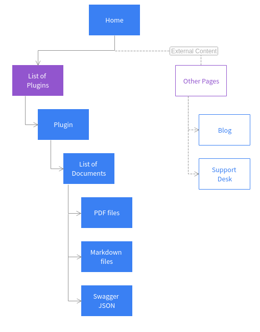

# Zowe Documentation Viewer Architecture

App is written in [Typescript](http://www.typescriptlang.org/), as it leads to more well-structured code than Javascript.

## Root files & directories

At the root of an App's directory, the following content is found.

### pluginDefinition.json

- This file describes the Plugin to the App server.

- A `Plugin` is the unit of extensibility for the App server, where documentation viwer app is a `Plugin` of type `Application`, the most common and visible to the end-user.

- Definition file of the app tells the server whether the App has server-side [Dataservices](https://github.com/zowe/ZLUX/wiki/ZLUX-Dataservices), client-side web content, or both.

- The attributes of this file are described in the [Plugin Definition article](https://github.com/zowe/ZLUX/wiki/ZLUX-Plugin-Definition-&-Structure).

### nodeServer

- If Documentation Viwer App has Dataservices of the type "router", these are interpreted by the App Server by attaching them as ExpressJS routers. 

- Use of Typescript results in build steps as the pre-transpilation Typescript content is not to be consumed by NodeJS. Therefore, within **nodeServer**, server-side source code is present. At runtime, the server loads **router dataservices** from the lib directory.

### webClient

- Documetation viewer app server serve static content for a client.  

- Use of Typescript and Webpack both result in build steps as the pre-transpilation Typescript and the pre-webpack content are not to be consumed by the browser. Therefore, the client side source code is separated from the served content by placing within webClient.

## Runtime content

At runtime, a different set of directories are used by the server & client rather than those described for use in the dev environment.

### lib

- The lib directory is where router-type Dataservices are loaded by use in the App Server. 

### web

- The web directory is where the server serve static content for the app.

- Typically this directory contains the output of a webpack build. Anything put in this folder can be accessed by a client, so only put content here that is intended to be consumed by clients.

Here's the image of sitemap of documentation viewer app

