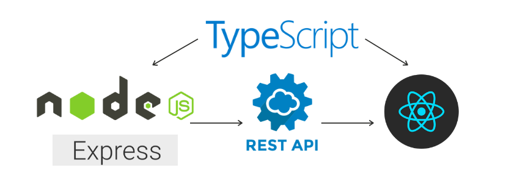
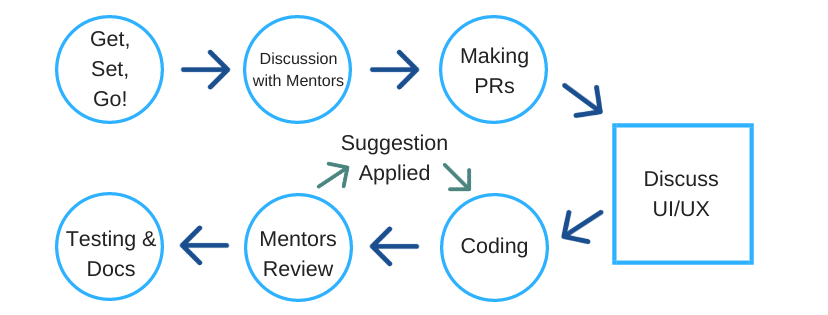
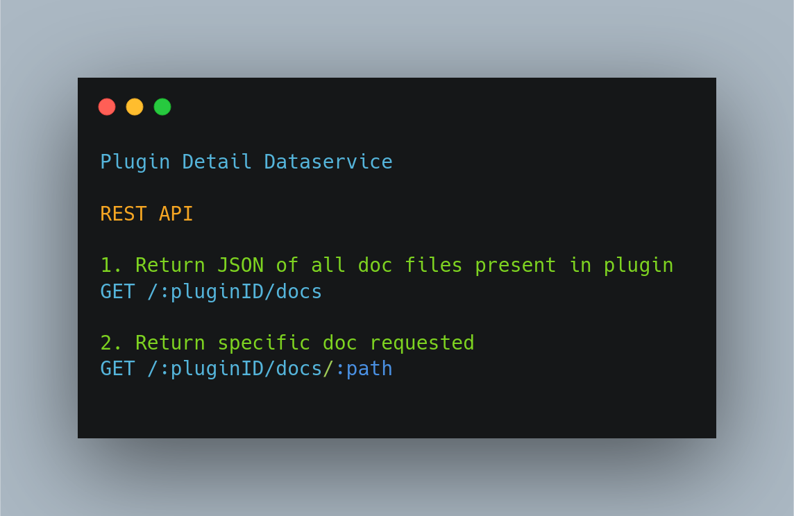
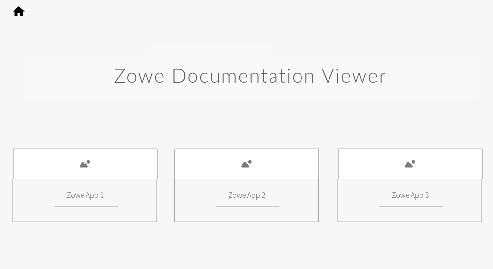
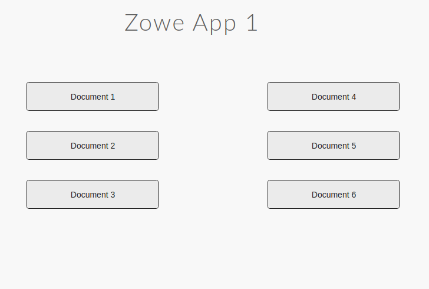

# Detailed Design

Here's the image of technologies used:

## Project Lifecycle

There will be two modules mainly in the app:

## `nodeServer`

Datservice 1**

## `webClient`

UI Mockups**

This page will be updated regularly.

> ** These may change during the course of the program.
